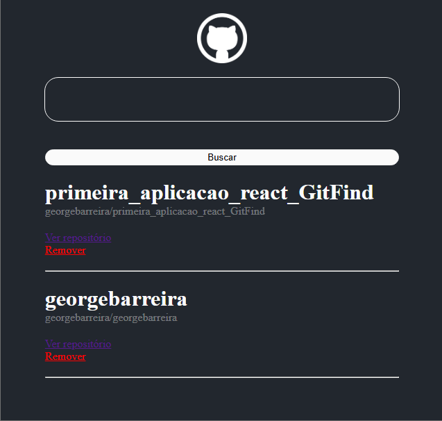

# Aplicação Github Wiki

Este projeto é uma aplicação de consumo da API REST do GitHub desenvolvida utilizando React e Vite para o curso React Developer da Dio.

## Proposição do projeto

- Consumir api do github para proporcionar um mecanismo de busca de repositórios (user/repo) listando-os dinamicamente.

## Link do projeto online

